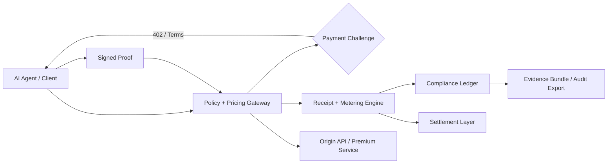
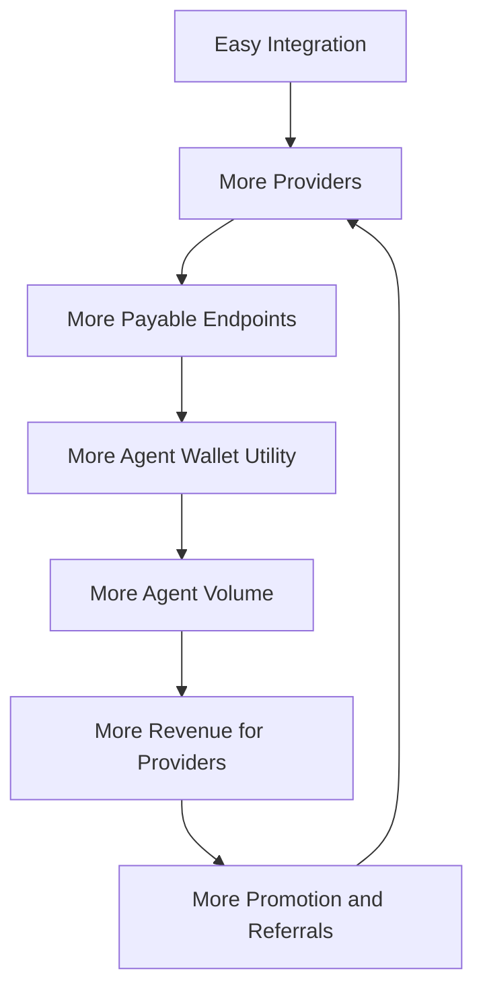
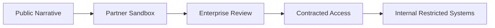

# X407

<div align="center">

## Agent Commerce Infrastructure at Enterprise Grade

**X407** is a premium protocol-and-platform initiative for agent-native payments, programmable access control, compliance-aware monetization, and machine-to-machine commerce.


</div>

---

## Executive Positioning

X407 is designed to be chosen over legacy rails, closed billing systems, and generic chain infrastructure by delivering a complete **agent-commerce operating layer**:

- **protocol-native monetization** for APIs and AI services
- **edge-side payment enforcement** and proof verification
- **compliance-ready receipts and audit trails**
- **enterprise-ready integration and policy control**
- **commercially defensible IP layering**

Instead of competing only as a chain, X407 competes as the **revenue, trust, and orchestration layer** for the machine web.

---

## Table of Contents

- [Why X407 Wins](#why-x407-wins)
- [System Thesis](#system-thesis)
- [Strategic Differentiation Matrix](#strategic-differentiation-matrix)
- [Competitive Positioning](#competitive-positioning)
- [Platform Architecture](#platform-architecture)
- [Adoption Flywheel](#adoption-flywheel)
- [IP Protection Strategy](#ip-protection-strategy)
- [SaaS Disclosure Model](#saas-disclosure-model)
- [Implementation Priorities](#implementation-priorities)
- [90-Day Execution](#90-day-execution)
- [Testing Program](#testing-program)
- [Growth, Content, and Promotion](#growth-content-and-promotion)
- [Pilot and Partner Program](#pilot-and-partner-program)
- [Repository Structure](#repository-structure)
- [Commercial Notes](#commercial-notes)

---

## Why X407 Wins

| Area | X407 Position | Why It Matters |
|---|---|---|
| 🟢 Agent UX | Native request → challenge → proof → fulfill loop | Removes human billing friction |
| 🟢 Economics | Real-time monetization and micro-request viability | Better fit for AI traffic |
| 🟢 Trust | Signed proofs, receipts, evidence bundles, anchored records | Enterprise and regulated adoption |
| 🟢 Integration | Drop-in gateway and SDK pattern | Faster onboarding than custom billing stacks |
| 🟢 Commercial Control | Public protocol surface + proprietary premium engines | Adoption without giving away moat |
| 🟢 GTM | Content + partners + white-label + certifications | Creates ecosystem pull |

---

## System Thesis

> The winning system for machine commerce will not be the one with only the fastest settlement rail. It will be the one that makes **monetization, compliance, integration, and trust** operationally simple for both providers and agent consumers.

X407 is intended to own that layer.

---

## Strategic Differentiation Matrix

| Capability | Legacy API Billing | Generic Chain Rail | X407 |
|---|---|---|---|
| Human sign-up required | 🔴 Yes | 🟡 Often | 🟢 No |
| Agent-native payment flow | 🔴 Weak | 🟡 Partial | 🟢 Core feature |
| Edge verification | 🔴 Rare | 🔴 Rare | 🟢 Native |
| Compliance receipts | 🔴 Manual | 🟡 Custom | 🟢 Built-in |
| Pay-per-call economics | 🔴 Poor | 🟡 Variable | 🟢 Strong |
| White-label provider model | 🟡 Some | 🟡 Some | 🟢 Strategic |
| Commercial moat beyond chain speed | 🔴 Low | 🟡 Medium | 🟢 High |

---

## Competitive Positioning

X407 should be positioned as the **monetization and trust operating layer** for machine commerce.

- comparison and market framing: [docs/COMPETITIVE-POSITIONING.md](docs/COMPETITIVE-POSITIONING.md)
- 90-day rollout plan: [docs/EXECUTION-90-DAYS.md](docs/EXECUTION-90-DAYS.md)
- pilot structure: [docs/PILOT-PARTNER-PROGRAM.md](docs/PILOT-PARTNER-PROGRAM.md)

---

## Platform Architecture



### Core layers

1. **Gateway Layer**  
   Enforces paid access, verifies proofs, and standardizes challenge/receipt behavior.

2. **Policy Layer**  
   Determines route pricing, rate rules, customer tiering, geography controls, and entitlement logic.

3. **Metering Layer**  
   Tracks usage, balances, receipts, settlement obligations, and revenue analytics.

4. **Compliance Layer**  
   Produces audit-friendly artifacts, evidence bundles, and policy-aligned logs.

5. **Settlement Layer**  
   Handles finality routing, reconciliation, and future multi-rail abstraction.

---

## Adoption Flywheel



### Goal
Create a system where **every new provider increases the value of every existing wallet and every new wallet increases the value of every provider**.

---

## IP Protection Strategy

X407 should be structured as a **layered commercial IP system**.

### Public layer
- protocol documentation
- selected SDK interfaces
- high-level architecture
- limited integration examples
- partner onboarding materials

### Protected layer
- policy engine implementation
- pricing and conversion optimization logic
- fraud / abuse heuristics
- receipt intelligence and compliance automation
- settlement routing logic
- enterprise dashboards and analytics

### Legal / commercial controls
- trademark protection for brand and product marks
- proprietary source license for protected components
- contributor assignment / work-for-hire controls
- partner NDAs for sensitive implementation material
- tiered access to internal documentation

See [docs/IP-PROTECTION.md](docs/IP-PROTECTION.md).

---

## SaaS Disclosure Model

Not everything should be exposed publicly.

| Tier | Audience | What They See |
|---|---|---|
| Tier 1 | Public market | vision, protocol, benefits, top-line architecture |
| Tier 2 | Qualified partners | integration kits, route examples, sandbox access |
| Tier 3 | Enterprise prospects | compliance posture, security model, pricing architecture |
| Tier 4 | Contracted customers | operational guides, implementation specifics, dashboards |
| Tier 5 | Internal only | proprietary engine logic, anti-abuse methods, sensitive playbooks |



See [docs/SAAS-DISCLOSURE-MODEL.md](docs/SAAS-DISCLOSURE-MODEL.md).

---

## Implementation Priorities

### Phase 1 — Internal Dogfooding
- protect premium internal APIs with the X407 challenge flow
- implement receipts and usage tracking
- test compliance export and evidence packaging
- benchmark latency, conversion, and abuse handling

### Phase 2 — Pilot Program
- onboard 3 to 5 design partners
- ship sandbox SDKs and provider templates
- compare provider revenue vs legacy billing approaches
- create measurable case studies

### Phase 3 — Ecosystem Rollout
- certification program
- provider directory
- white-label deployments
- integration partnerships
- public benchmarks and thought leadership

See [docs/IMPLEMENTATION-ROADMAP.md](docs/IMPLEMENTATION-ROADMAP.md).

---

## 90-Day Execution

The operating plan now includes:

- internal dogfooding and benchmark setup
- partner pilot activation
- public proof, case studies, and enterprise enablement

See [docs/EXECUTION-90-DAYS.md](docs/EXECUTION-90-DAYS.md).

---

## Testing Program

A serious system wins through proof, not claims.

### Protocol tests
- challenge formatting
- signature validation
- nonce expiry
- replay resistance
- receipt generation
- settlement reconciliation

### Adversarial tests
- forged proof attempts
- abuse and throttling simulations
- malformed header handling
- wallet-drain scenarios
- double-use / timing race tests

### Economic tests
- micro-pricing conversion
- state-channel efficiency
- route profitability
- edge latency under load

### Enterprise tests
- evidence export integrity
- policy enforcement behavior
- audit trail completeness
- role / override logging

---

## Growth, Content, and Promotion

### Core content engines
- technical blog series
- enterprise trust/compliance content
- provider monetization guides
- case studies and benchmarks
- partner announcement kits

### Promotion channels
- founder-led thought leadership
- GitHub examples and docs
- developer communities
- ecosystem partnerships
- certification badges and directories
- sandbox access campaigns

### Recommended content tracks
- **Why HTTP payment challenges matter now**
- **How agents pay for APIs without subscriptions**
- **Receipts, evidence bundles, and auditable machine commerce**
- **How to monetize premium AI endpoints in minutes**

See [docs/GTM-AND-CONTENT.md](docs/GTM-AND-CONTENT.md).

Campaign assets and ad concepts live in [docs/BLOGS-ADS-AND-CAMPAIGNS.md](docs/BLOGS-ADS-AND-CAMPAIGNS.md).

---

## Pilot and Partner Program

The pilot motion should target:

- premium API providers
- AI platform builders
- regulated workflow operators

See [docs/PILOT-PARTNER-PROGRAM.md](docs/PILOT-PARTNER-PROGRAM.md).

---

## Repository Structure

```text
X407/
├─ .github/
│  ├─ ISSUE_TEMPLATE/
│  ├─ pull_request_template.md
│  └─ workflows/
│     └─ pages.yml
├─ assets/
│  ├─ site.css
│  └─ site.js
├─ docs/
│  ├─ assets/
│  │  ├─ site.css
│  │  └─ site.js
│  ├─ compare/
│  │  └─ index.html
│  ├─ infrastructure/
│  │  ├─ index.html
│  │  ├─ agentic-funding-transaction-explorer.html
│  │  ├─ aws-machine-commerce-infrastructure.html
│  │  ├─ enterprise-agent-payment-infrastructure.html
│  │  └─ layer1-settlement-orchestration.html
│  ├─ insights/
│  │  ├─ index.html
│  │  ├─ agent-commerce-infrastructure.html
│  │  ├─ ai-to-ai-payments-vs-api-keys.html
│  │  ├─ aws-layer1-machine-commerce-infrastructure.html
│  │  ├─ enterprise-trust-receipts-compliance.html
│  │  ├─ how-to-monetize-apis-for-ai-agents-without-api-keys.html
│  │  ├─ keyword-clusters.html
│  │  ├─ what-is-ai-to-ai-payment-infrastructure.html
│  │  └─ why-http-402-becomes-strategic-for-paid-apis.html
│  ├─ pilot/
│  │  └─ index.html
│  ├─ BLOGS-ADS-AND-CAMPAIGNS.md
│  ├─ CNAME
│  ├─ COMPETITIVE-POSITIONING.md
│  ├─ EXECUTION-90-DAYS.md
│  ├─ GTM-AND-CONTENT.md
│  ├─ IMPLEMENTATION-ROADMAP.md
│  ├─ index.html
│  ├─ IP-PROTECTION.md
│  ├─ PILOT-PARTNER-PROGRAM.md
│  ├─ robots.txt
│  ├─ rss.xml
│  ├─ SAAS-DISCLOSURE-MODEL.md
│  └─ sitemap.xml
├─ .gitignore
├─ .nojekyll
├─ CONTRIBUTING.md
├─ index.html
├─ LICENSE.md
├─ README.md
└─ SECURITY.md
```

---

## Commercial Notes

- This repository is structured as a **strategic commercial foundation**, not a fully public disclosure of core moat logic.
- Sensitive implementation details should remain outside the public repo unless intentionally licensed.
- Public material should be optimized for **trust, adoption, and conversion** without overexposing proprietary advantage.

---

## Recommended Next Moves

1. Publish core narrative and category-defining content
2. Add provider quickstarts and wallet demos
3. Add benchmark and testing results as they become available
4. Add partner pilot intake and certification pathways
5. Keep proprietary execution logic in restricted repos or internal systems
6. Use the competitive matrix and 90-day execution plan as the operating blueprint

---

<div align="center">

**X407**  
Commercial-grade infrastructure for agent-native monetization, trust, and scale.

</div>
